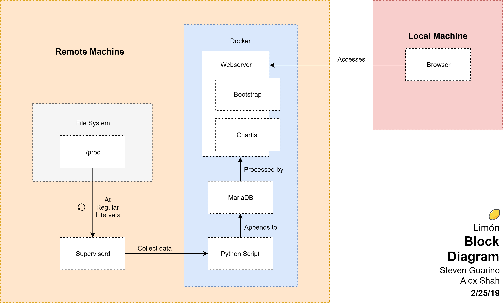

# Limón: Linux Monitor
### Alex Shah & Steven Guarino
### MSCS 710 Spring 2019

---

# About
### Limón is a Docker based resource monitoring tool for Linux.  
### Run Limón on the device you want to monitor, access it in any browser.

# Requirements:
Ubuntu LTS (18.04+)  
Docker (17+)  
Docker-Compose (1.13+)  

# Installation
* Setup:

      sudo apt update && sudo apt install -y git docker docker-compose
      
* Clone the repository on the machine you want to monitor:

      git clone https://github.com/AlexKShah/MSCS710.git; cd MSCS710;

* Build:

      sudo docker-compose up --build

* Monitor

     Navigate to `machineIP:5000` in a browser

# Configuration
* Modify parameters like how often to gather metrics at:
    
      limon/flask/sys_poll.yml
